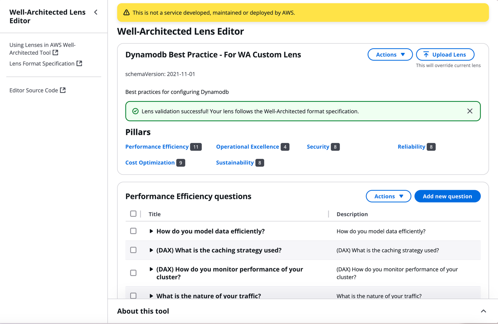
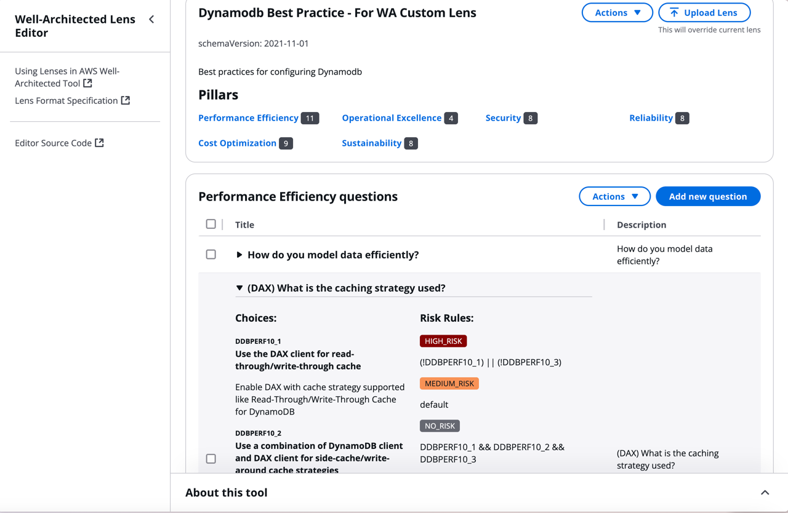

# Well-Architected Editor

### Custom lens creation with ease

### Quickstart

To start using the Well-Architected Editor, visit the [editor](https://pascal.euhus.dev/well-architected-editor/) and start creating your custom lens, or simply upload one of the Custom-Lens-WA-Hub e.g. [DynamoDB Lens](https://github.com/aws-samples/custom-lens-wa-hub/tree/main/DynamoDB)

### Purpose

The Well-Architected Editor is a tool for creating and editing AWS Well-Architected Lenses. It is built with ❤️, 🤘, [React](https://react.dev), and the [Cloudscape Design System](https://cloudscape.design).

### Principles and Goals

The editor is built with the following principles and goals in mind:

- **Local Editing and Saving**: Data is not sent anywhere; it is stored in the browser's local storage and won't leave your computer.
- **Ease of Use**: The editor simplifies the process of creating and editing lenses, eliminating the need to manually edit JSON files.
- **Validation**: Validate your lens before uploading it to the AWS Well-Architected Tool, making it easy to spot and fix mistakes.

### Creator

The Well-Architected Editor was created by [Pascal Euhus](https://github.com/pacovk).

### Source Code

The source code is available on [GitHub](https://github.com/PacoVK/well-architected-editor).

### Feedback and Contributions

We welcome feedback and future contributors! If you have suggestions or would like to contribute, please visit our [GitHub repository](https://github.com/PacoVK/well-architected-editor) and open an issue or submit a pull request. Thank you for helping us improve the Well-Architected Editor!
